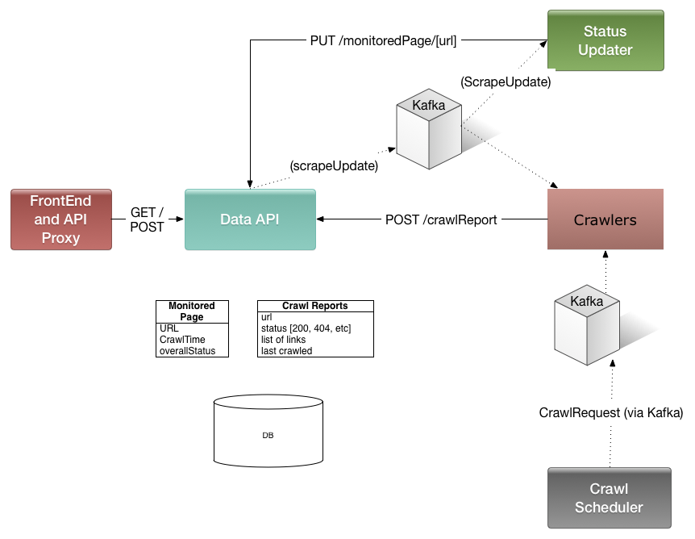
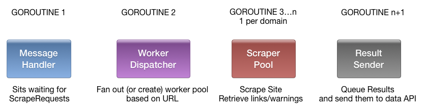
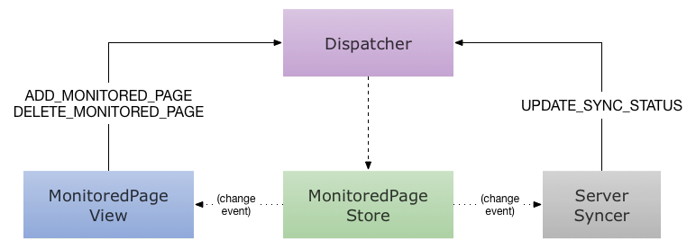

# Link Checker Design Document

## Overview

The Link Checker service is a monitoring tool that monitors a set of URLs for broken links (where broken link is defined as something that does not return 200) and alerts a monitoring address if broken pages are detected.

## Functional Requirements

  1. Users must be able to add a list of monitored pages to the system that will be checked for broken links.
  
  1. Every 30 minutes (+ or minus a random offset so all requests aren't triggered at the same time), the Link Checker service should retrieve the contents of each monitored page. If the page is no longer reachable, an error should be triggered; if it is reachable then the system should retrieve all HTTP or HTTPS links from the monitored page.
  
  1. The Link Checker service should retrieve the contents of each page found in the previous step. If a page cannot be retrieved, then an error should be triggered.
  
  1. When a page and all of its direct descendants are reachable when they previously were not, the user should be notified that their page is no longer broken.
  
## System Architecture

 The Link Checker service consists of a few components. In general they are all written in Java mainly to facilitate code re-use. The Scrapers are written in golang.
 
 * **Data API**
 
 The Data API is responsible for saving or retrieving information that needs to be persisted in the system. For example, the list of monitored pages, or crawl report for a given page. Anything that needs to store or retrieve data from the source of truth should contact the Data API.
 
 The Data API is also responsible for publishing data change events via a Kafka topic so that other components in the system can either update their local caches or take actions as required.
 
 * **Crawl Scheduler**
 
 The crawl scheduler is responsible for deciding when a URL should be crawled, and dispatching a message to the crawlers at the appropriate time. Every Monitored Page in the system is periodically crawled; the scheduler is also responsible for scheduling crawls for pages that are linked to by a Monitored Page.
 
 It is designed to ensure that no URL is crawled more than a given interval (currently 30 minutes).
 
 Crawls are scheduled by emitting ScrapeRequests over a Kafka topic.
 
 * **Crawlers**
 
 Crawlers are responsible for retrieving the contents of a given web page, parsing links out of the page if it contains HTML, and then reporting the crawl status. They listen on a Kafka topic for ScrapeRequests and then inform the Data API of the results.
 
 
 * **Crawl Status Updater**

 After a given page is crawled, if the state has transitioned to broken the system needs to find all monitored pages that link to the crawled page and mark them as now broken; if the state has transitioned from broken -> successful, the system also needs to recalculate page status.
 
 The crawl status updater is responsible for this.
 
 * **Status Notifier**
 
 Emails users watching a monitored page if the status has gone red or green.
 
 * **Frontend API Proxy**
 
 The frontend API proxy is publically available and used by the front-end. It mainly just proxies requests to/from the Data API.
 
 It uses node.js and the Express framework. The API proxy also serves the front-end static assets.
 
 * **Frontend**
 
 Allows users to add monitored pages / see their status in real time.
 
 Uses React JS and the Flux style.

# System Components

## Messaging Infrastructure
 
Kafka and Protobuf are used to send messages between the various components in the system. Kafka's persistence is set high enough so that if the crawl scheduler or status update die or need to be updated they can easily pick up from the last log message left off.

## Service Layer

The service-layer contains most of the coordination code for the link_checker project. It is 
generally responsible for persisting or retrieving any data from Cassandra and also emitting updates when new data is posted.

No other components should be directly interacting with Cassandra, nor should they emit any Kafka events themselves that talk about data changing in the system -- this way the service layer can maintain transactional guarantees.

API docs are generated using Swagger and are available at http://localhost:8080/swagger/. (The JSON spec is available at http://localhost:8080/api-docs.)

## Crawler

The crawler is responsible for:

 * Listening to a Kafka topic for ScrapeRequests
 * Rate-limiting requests to a domain to N/sec (currently 3)
 * Retrieving a given URL [report error if code is not in the 200s]
 * Parsing the HTML output and extracting any href links
 
It is implemented in Golang and uses a set of goroutines to coordinate.

 
## Crawl Scheduler

The crawl scheduler is the component that controls the crawler instances. It has two main responsibilities:

* Every 30 minutes (+/- a little bit to avoid a flood of messages), schedule crawls for all Monitored Pages in the system
* When a link is discovered on a Monitored Page, ensure that said link has been crawled in the last 30 minutes; schedule a crawl of that page if it hasn't. 
    - The "ensure said link has been crawled in the last 30 minutes" rule is mostly to avoid unnecessary server load -- eg if I monitor 3 pages on http://www.cnn.com, there is no need to recrawl all the links in the header and footer 3 times in a row.

The scheduler assumes it can hold every link in the system in-memory which should be a pretty safe assumption for the immediate future. It relies on the Data API to retrieve the list of Monitored Pages and Kafka to send and receive ScrapeRequests and ScrapeResponses, respectively.

Needs to:
  Hold a map URL -> last scheduled
  Hold a priority queue of crawl schedule times

  Wake up every minute and queue threads
  Process correct ones

## Status Updater

The status updater is responsible for processing CrawlReports for various URLs and updating the status of any monitored pages that link to said URL. If the CrawlReport is for a monitored URL itself then the status must also be updated.

The general algorithm upon processing a CrawlReport should look something like this:

 * [Optimization] Retrieve the last known status of the page the CrawlReport is for. If the last known status and the current status are the same, we don't need to do anything.
 
 * Retrieve the list of monitored pages and their current status. that link to the URL the CrawlReport is for. Note that every URL implicitly links to itself (eg if a monitored page can't be retrieved; its status should also be marked as broken)  
 * For each page:
 	* Retrieve latest CrawlReports for all links on it and set status appropriately (GOOD, CRAWL_IN_PROGRESS, BAD)
 	
To think about:

 * CrawlReports get written to Data API, which then fires CrawlReportAdded event -- how can optimization above be done?
   
 * Further optimizations possible -- monitored pages have a 'good', 'bad', and 'unknown' set of links, so then when a page flips we don't need to recheck all of the links on the page
 
 	* This makes processing a CrawlReport trickier and more expensive (because the PUT /CrawlReport operator needs to retrieve status info for any new links on the page) at the cost of not having to do as many reads when a given page changes status.
 	* And processing cost is only slightly more expensive unless a new link is discovered on a monitored page (or one goes away)

**Status updater v1**: Ignore any optimization tricks until we know they are needed. Just pull all links when a page changes status and update any monitored pages appropriately.

## Frontend

The front-end consists of a React front-end that lets users add, delete, and view status of various monitored pages.

The front-end optimistically shows monitored page status as added or deleted and syncs them in the background. The syncer runs from a single queue so updates from a single client should be consistent.

### Actions and data flow

There are several interactions around adding monitored pages:

* A user can add a MonitoredPage from the UI.
* A user can delete a  MonitoredPage from the UI.
* The server syncer can report that a pending add/delete operation has completed.
* The server syncer can add, delete, or update status of any MonitoredPages because the state has been changed by some other part of the system.

In the front-end system, the UI looks something like:

	url: URL of the monitored page
	status: Status of the monitored page (eg does it contain broken links?)
	sync_status: Are there any pending operations for this Monitored Page? (eg user has added it locally but it has not yet been posted to the data API)
	
### Synchronizing with Server

The front-end is also periodically retrieving monitored page status and the list of monitored pages for the user. 

The new list is merged with any pending sync operations and it is assumed that the pending operations will eventually be synced.

There are two different operations that can be synced to the server - `ADD_MONITORED_PAGE` or `DELETE_MONITORED_PAGE`. A MonitoredPage can also have status `SYNCED`. When a server POSTs successfully sends the given request to the server it will post a `UPDATE_SYNC_STATUS` action with the given URL and operation that just completed and the store will update its status to synced if there is a match.  

*Note*: Since the key for a server operation is `{url, op_type}` there is room in this design for the UI to get out of sync with the server if multiple operations for the same URL are issued and not synced for the server. For example, say the user adds a MonitoredPage, deletes it, and then adds it back in rapid succession. The sync state for that url will be `ADD_SYNCING` - when the first `UPDATE_SYNC_STATUS` is processed it will set the state for that node to `SYNCED` even though there are pending operations in the queue. This should be a pretty rare case so is not designed around. 

# Data Design

TODO fillin
